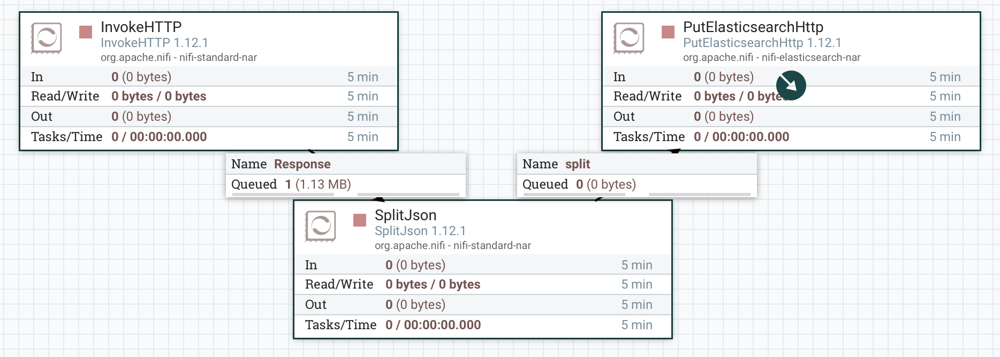
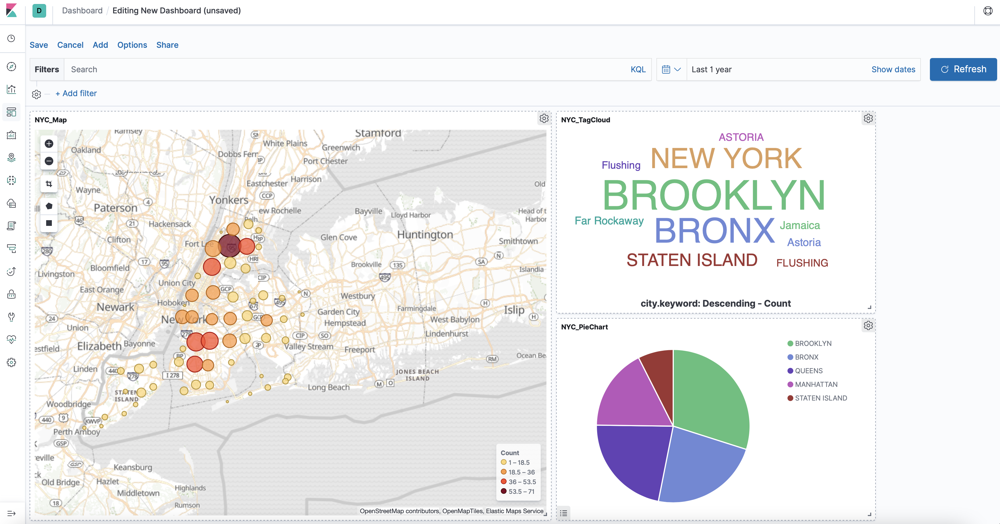

# Ejercicio_Nifi-ELK

```
Usando nifi+ELK, debéis presentar una solución que muestre, sobre un mapa, 
la disposición de delitos presentes en esta API:

https://data.cityofnewyork.us/Social-Services/311-Service-Requests-from-2010-to-Present/erm2-nwe9
```
## A. Docker Compose

| Component | Port |
| --- | --- | 
| Elasticsearch | 9200 |
| Kibana | 5601 |
| Nifi | 8080 |


## B. NiFI

| Component | Port |
| --- | --- | 
| InvokeHTTP | API ingestion |
| SplitJson | Convert json array in separated components |
| PutelasticsearchHTTP | Put the data into Elasticsearch |



## C. ELK

#### Final Dashboard


